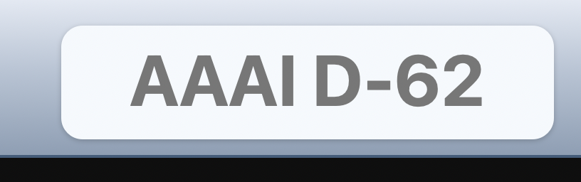
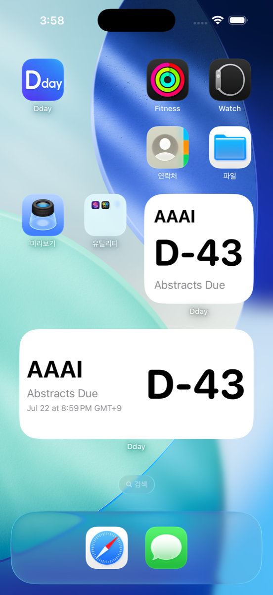
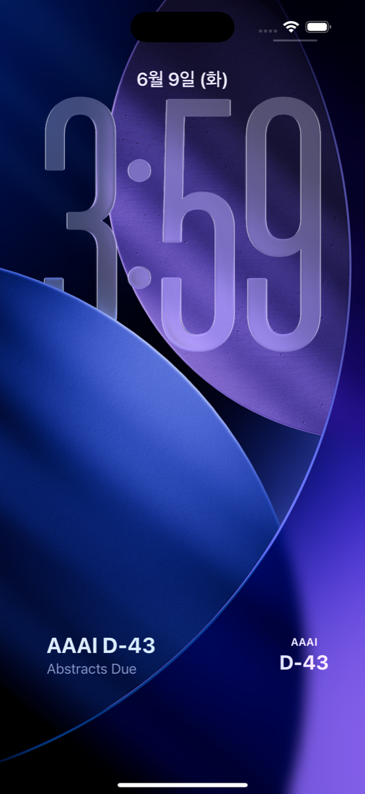

# Dday

Dday keeps AI conference deadlines close at hand across Apple devices.

Use it as a quiet macOS menu bar countdown, or as iPhone and iPad widgets for the
deadline you care about most.

[한국어 README](README.ko.md)

## Preview

<p align="center">
  
  
  
</p>

## Platform Guides

| Experience | Platform | Guide |
| --- | --- | --- |
| Menu Bar D-Day | macOS | [Menu Bar D-Day for macOS](docs/MENUBAR_DDAY.md) |
| Widget D-Day | iPhone, iPad | [Widget D-Day for iPhone and iPad](docs/WIDGET_DDAY.md) |

## Features

- Curated AI conference deadline list grouped by Machine Learning, Computer Vision, NLP, and General AI.
- Local-time D-Day calculation with AoE deadline support.
- User-selected main D-Day for the app and widgets.
- Custom D-Days for deadlines that are not in the conference list.
- Korean, English, and system-language modes.
- Local-first settings and custom data.
- Manual conference list update from the public GitHub dataset.

## Distribution

- iPhone and iPad: distributed through the App Store.
- macOS: distributed through signed and notarized GitHub Releases.

Download the macOS app from the
[latest GitHub Release](https://github.com/mindw96/AI-Conference-Dday/releases/latest).

## Repository Layout

```text
Dday/
  Apps/
    Mobile/                 # iPhone/iPad app and WidgetKit extension
  Checks/
    DdayCoreChecks/          # lightweight validation runner
  Sources/
    DdayCore/                # shared models, data loading, and D-Day logic
    DdayApp/                 # macOS menu bar app
  data/
    conferences.json         # public conference deadline dataset
  docs/
  scripts/
```

`DdayCore` is shared across Apple platforms. The platform apps are intentionally
thin: they present deadlines, settings, widgets, and release-specific UI around
the same core data model.

## Development

Build the Swift package:

```bash
swift build
```

Run the core data and calculation checks:

```bash
swift build --product DdayCoreChecks
.build/debug/DdayCoreChecks
```

Build the macOS app bundle:

```bash
./scripts/build_app.sh
```

Build the iPhone/iPad app from Xcode:

```text
Apps/Mobile/DdayMobile.xcodeproj
```

For release work, see:

- [macOS Signing and Notarization](docs/MACOS_NOTARIZATION.md)
- [Release Guide](docs/RELEASE_GUIDE.md)
- [TestFlight Preparation Guide](docs/TESTFLIGHT_PREP.md)

## Data

The public conference list lives in:

```text
data/conferences.json
```

Every conference entry should include a source URL and the date when the source
was checked.

## Privacy

Dday is local-first. It does not require accounts, collect analytics, or include
tracking SDKs. See [Privacy](docs/PRIVACY.md).

## License

TBD.
